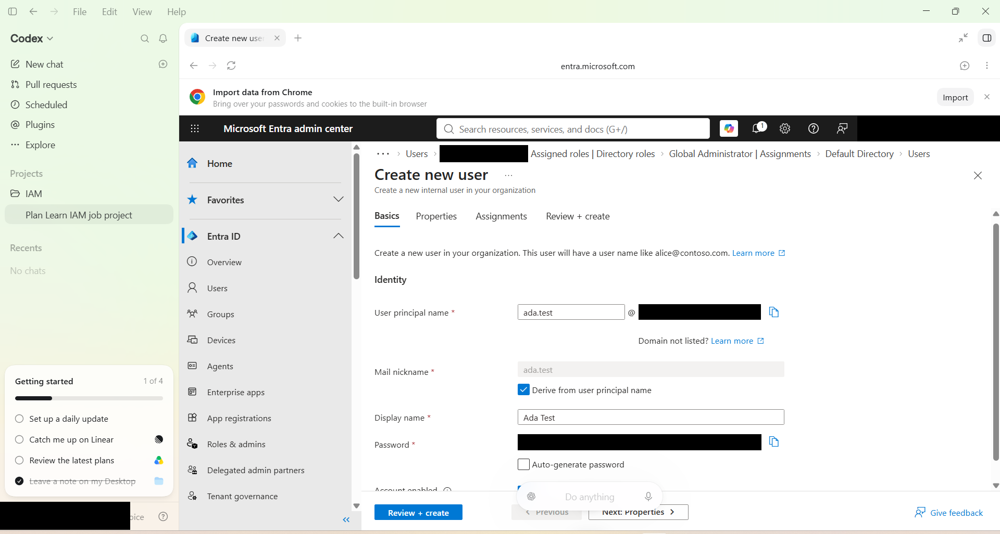
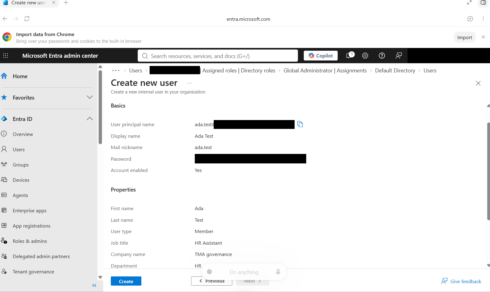
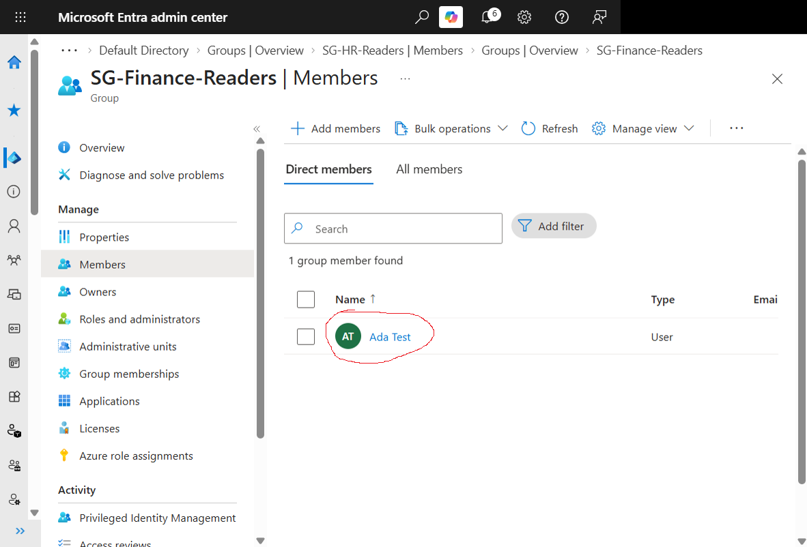
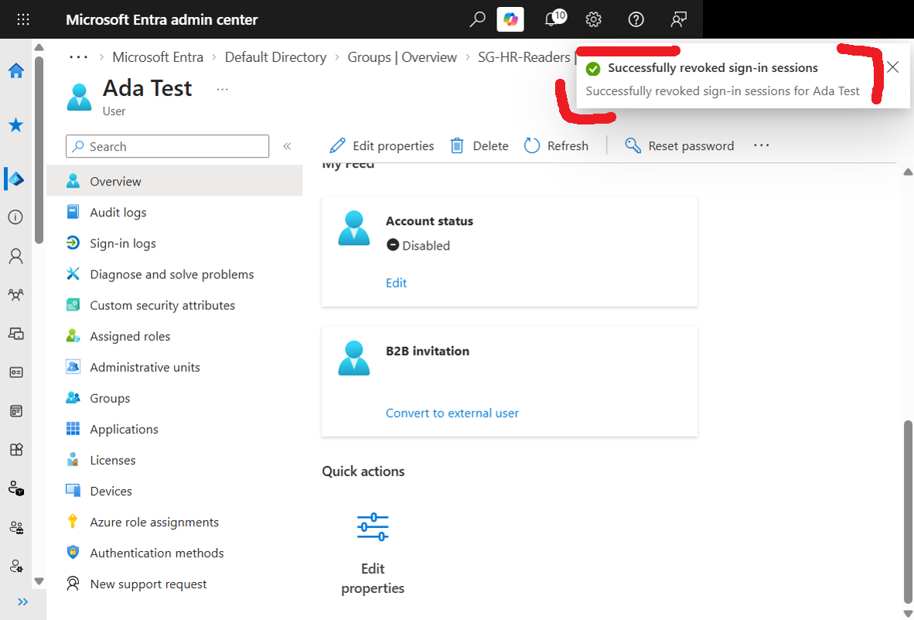
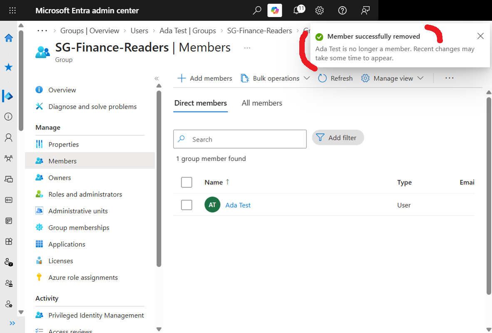

# Employee Identity Lifecycle Management with Microsoft Entra ID

## Project status

Core Joiner–Mover–Leaver exercise completed in a personal learning lab. Resource-access testing is a future extension.

## Objective

Practise employee onboarding, department transfers, and offboarding in Microsoft Entra ID, and document account settings and group membership verification.

## Business scenario

Adera Technologies is a fictional company with HR and Finance departments. This lab follows Ada Test as she joins HR, moves to Finance, and leaves the company. Manager approval is simulated for this exercise.

## Tools

- Microsoft Entra admin center
- GitHub for project documentation

## Completed activities

- Created a fictional employee account.
- Created HR and Finance security groups with Assigned membership.
- Transferred group membership and updated the employee profile.
- Disabled the account and submitted session revocation.
- Removed the remaining lab group membership.
- Documented actions, verification results, and testing limitations.

## Lab boundaries

This project uses a fictional employee in a personal lab, not a production environment. I used my lab account with the Global Administrator role; this does not mean every task requires that role.

The groups are not connected to applications or documents. Their names describe intended access but do not enforce read-only permissions. This lab verifies identity and membership changes, not access to HR or Finance files.

## Activity 1 — Create an employee account

### Business requirement

A new HR Assistant, Ada Test, needs an employee account.

### Actions completed

Created Ada's account with these profile values:

- Display name: Ada Test
- Department: HR
- Job title: HR Assistant

### Verification

Found Ada in All users and opened her profile. Confirmed the HR department and HR Assistant job title. The initial account was enabled.

### Evidence

The following screenshots show configuration before submission, rather than proof that account creation finished. Personal account details, the tenant domain, and password fields have been covered on copies of the original screenshots.

User creation basics:

Review before creation:

### What I learned

A user account represents an employee's digital identity. Setting Department to HR does not automatically grant access to HR resources.

## Activity 2 — Create an HR security group

### Business requirement

Organize HR employees who will need read-only access to employee records.

### Actions completed

- Created the security group SG-HR-Readers.
- Used Assigned membership.
- Added Ada Test as a member.

### Verification

Opened the group's Members page and confirmed Ada Test was listed.

### Evidence

The initial HR membership was checked during the exercise. A matching HR membership screenshot still needs to be added; the image previously labelled as HR membership actually shows the Finance group.

### What I learned

Assigned membership is managed manually. Group membership can grant resource access only when the appropriate permissions are connected to the group.

## Activity 3 — Transfer an employee between departments

### Business scenario

Ada moves from HR to Finance, with simulated manager approval.

### Actions completed

- Created SG-Finance-Readers.
- Removed Ada from SG-HR-Readers.
- Added Ada to SG-Finance-Readers.
- Updated her department to Finance and job title to Finance Assistant.

### Verification

- Confirmed Ada was absent from the HR group's member list.
- Confirmed Ada was present in the Finance group's member list.
- Confirmed her updated department and job title were saved.

### Evidence

HR membership change:

Finance membership change:

Confirmed Finance membership:

Updated profile:

### What I learned

A mover process removes obsolete memberships, assigns appropriate new memberships, and verifies both changes. Updating profile information is a separate action.

## Activity 4 — Offboard an employee

### Business scenario

Ada leaves the fictional company and no longer needs access.

### Actions and verification

- Disabled Ada's account and confirmed Account enabled was No.
- Submitted Revoke sessions and received a success notification.
- Removed Ada from SG-Finance-Readers.
- Checked that Ada was absent from the Finance group's member list after removal.
- Retained the disabled account for lab documentation.

### Evidence

Disabled account and session-revocation notification:

Finance membership removal notification:

The second screenshot captures the successful removal notification while the previous member list is still visible. It does not capture the later absence check. A refreshed member-list screenshot remains to be added as evidence of that check.

### Testing limitations

- No active-session sign-out test was performed. The notification confirms that Entra reported a successful revocation action, not that an application session was observed ending.
- No blocked-sign-in test was performed after account disablement; verification used the account setting.
- No application or document permissions were connected to the groups, so resource-access removal was not tested.

### What I learned

Account disablement, session revocation, and membership cleanup are separate offboarding actions. Documentation should distinguish a successful administrative action from a tested user-facing result.

## Outcome and next steps

Completed a Joiner–Mover–Leaver exercise for one fictional employee. The lab demonstrates account administration, group membership management, and documentation of verification results.

Next steps are to add the refreshed offboarding membership screenshot, review remaining screenshots for personal information before public release, and connect a group to a test resource to verify allowed and denied actions.
